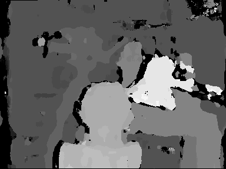
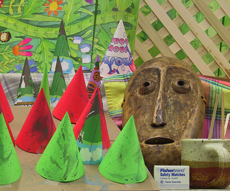

# Stereo Vision Core

[](https://doi.org/10.5281/zenodo.14033322)

This repository corresponds to an independent implementation of an [Stereo Vision Core](https://ieeexplore.ieee.org/document/6213095) accelerator following the architecture previously published by Wade S. Fife. [Here](https://github.com/divadnauj-GB/stereo_vision_core/blob/main/docs/Stereo_Match_Core.pdf) you will find the hardware architecture followed by our implementation in this repository, which follows an [stream processing](https://books.google.it/books?hl=en&lr=&id=zBvQEAAAQBAJ&oi=fnd&pg=PR13&dq=info:VoM82DhlG14J:scholar.google.com&ots=Kd3v-oct1x&sig=0lTqyihl90F4YWILAg8FHmiNHlI&redir_esc=y#v=onepage&q&f=false) computation approach as described by Donald G. Bailey. The accelerator architecture uses Census Transform (CT) + sum of hamming distance (SHD). In detail, the implemented accelerator uses Census Transform with (50%) sparcity.

It is worth noting that the original RTL description was developed on VHDL back in 2016 as part of my Master's thesis (You can check it [here](https://github.com/divadnauj-GB/stereo_vision_core/blob/main/docs/JuanDGuerrero-Msc-Thesis.pdf) the Spanish version, there is no English version yet). Now, this version also includes additional scripts that convert the VHDL code into Verilog using Yosys with the Ghdl plugin. The design is fully parametrizable and synthesizable. The accelerator has been implemented and evaluated on FPGAs, but such deployment is not part of this repository.

This repository provides an automated simulation setup using Modelsim. The following steps are required in order to simulate the accelerator.

## System Requierements

- Ubuntu >=20.04
- Python >=3.6
- Modelsim or Questasim
- OSS CAD Suite (Yosys and Ghdl)

## How to use this repository

### 1. Clone this repository

```bash
# Clone this repository
git clone https://github.com/divadnauj-GB/stereo_vision_core.git
cd stereo_vision_core
```

### 2. Run the simulation

There are two ways of simulating the accelerator. The first one simulates the original RTL description from the VHDL design files. The second option automatically converts the VHDL design into one RTL design file in Verilog using Yosys-ghdl plugging for Yosys (we created this [script](https://github.com/divadnauj-GB/stereo_vision_core/blob/main/scripts/yosys_ghdl.sh) for that purpose); this new Verilog file is then simulated using the same evaluation test-bench.

For VHDL simulation, you need to execute the script [run_stereo_simulation.py](https://github.com/divadnauj-GB/stereo_vision_core/blob/main/run_stereo_simulation.py)

```bash
python3 run_stereo_simulation.py
```

For Verilog conversion and Simulation you need  to execute the script [run_stereo_simulation_verilog.py](https://github.com/divadnauj-GB/stereo_vision_core/blob/main/run_stereo_simulation_verilog.py)

```bash
python3 run_stereo_simulation_verilog.py
```

### 3. Results visualization

After executing the simulation scripts, you need to wait some time to get the accelerator results. It is expected that the VHDL simulation takes around 3 minutes and the Verilog simulation takes around 30 minutes, these are results obtained from a server with 256 cores and 128GB RAM. The Verilog simulation takes significantly more time because during the conversion with yosys the original VHDL file is elaborated into basic units (i.e., regs, mux, adders, mults etc) significantly increasing the amount of objects required to simulate in comparison with the original VHDL description that contains several components in behavioural descriptions.

When the simulation ends, you will obtain a new image called Disparity_map.png, which shows the accelerator results. This image is converted into a grayscale format so that the lighter colors represent objects closer to the cameras, and darker colors belong to objects located further in the scene or undefined objects.

| | | | |
|:-:|:-:|:-:|:-:|
|Image| Left Image          |      Right Image     |     Output Result in grayscale    |
|Tsukuba|  |   ||
|Cones|  |   ||
|Teddy|  |   ||

## How to Cite?

```bibtex
  @software{Guerrero-Balaguera_SVC_2024,
    author = {Guerrero-Balaguera, Juan-David and Perez-Holguin, Wilson Javier},
    doi = {10.5281/zenodo.14033322},
    month = nov,
    title = {stereo vision core},
    url = {https://github.com/divadnauj-GB/stereo_vision_core},
    version = {1.0.0},
    year = {2024}
  }
```
