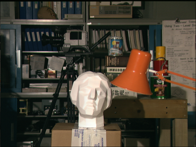
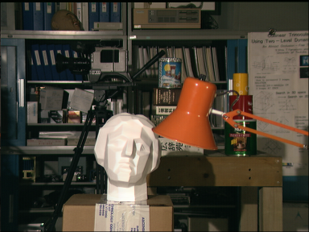
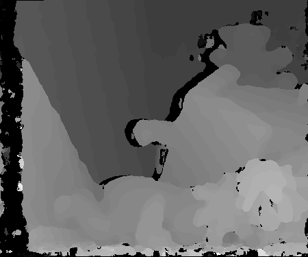
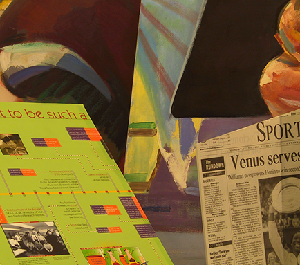
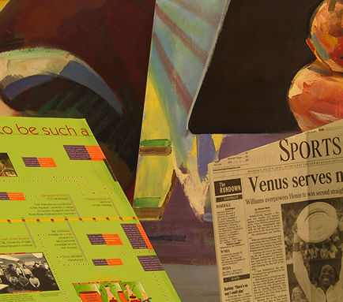
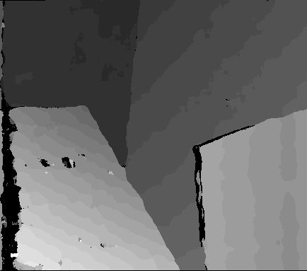

# Stereo Vision Core

[](https://doi.org/10.5281/zenodo.14033322)

This repository corresponds to an independent implementation of an [Stereo Vision Core](https://ieeexplore.ieee.org/document/6213095) accelerator following the architecture previously published by Wade S. Fife. [Here](https://github.com/divadnauj-GB/stereo_vision_core/blob/main/docs/Stereo_Match_Core.pdf) you will find the hardware architecture followed by our implementation in this repository, which follows an [stream processing](https://books.google.it/books?hl=en&lr=&id=zBvQEAAAQBAJ&oi=fnd&pg=PR13&dq=info:VoM82DhlG14J:scholar.google.com&ots=Kd3v-oct1x&sig=0lTqyihl90F4YWILAg8FHmiNHlI&redir_esc=y#v=onepage&q&f=false) computation approach as described by Donald G. Bailey. The accelerator architecture uses Census Transform (CT) + sum of hamming distance (SHD). In detail, the implemented accelerator uses Census Transform with (50%) sparcity.

It is worth noting that the original RTL description was developed on VHDL back in 2016 as part of my Master's thesis (You can check it [here](https://github.com/divadnauj-GB/stereo_vision_core/blob/main/docs/JuanDGuerrero-Msc-Thesis.pdf) the Spanish version, there is no English version yet). Now, this version also includes additional scripts that convert the VHDL code into Verilog using Yosys with the Ghdl plugin. The design is fully parametrizable and synthesizable. The accelerator has been implemented and evaluated on FPGAs, but such deployment is not part of this repository.

This repository provides an automated simulation setup using Modelsim. The following steps are required in order to simulate the accelerator.

## System Requierements

- Ubuntu >=20.04
- OSS CAD Suite [2024-11-18](https://github.com/YosysHQ/oss-cad-suite-build/releases/download/2024-11-18/oss-cad-suite-linux-x64-20241118.tgz)
  - Yosys 0.47+61 (git sha1 81011ad92, clang++ 18.1.8 -fPIC -O3)
  - GHDL 5.0.0-dev (4.1.0.r293.g9c6f59f9f.dirty) [Dunoon edition]
  - Verilator 5.031 devel rev v5.030-78-g5470cf9fa
- Python >=3.11
  - cocotb == 1.9.2
  - numpy == 2.1.3
  - pillow == 11.0.0
  - pytest == 8.3.3
- Modelsim [Optional]

## How to use this repository

### 1. Install yosys and verilator

You can use the OSS CAD Suite which include the required packages i.e., yosys, ghdl and verilator. Follow these steps:

  1. Download an archive matching your OS from the releases page. The stereo accelerator has been tested whit the realease [2024-11-18](https://github.com/YosysHQ/oss-cad-suite-build/releases/download/2024-11-18/oss-cad-suite-linux-x64-20241118.tgz). 
  2. Extract the archive to a location of your choice (for Windows it is recommended that path does not contain spaces)
  3. On macOS to allow execution of quarantined files xattr -d com.apple.quarantine oss-cad-suite-darwin-x64-yyymmdd.tgz on downloaded file, or run: ./activate in extracted location once.
  4. Set the environment as described below.

  ```bash
    export PATH="<extracted_location>/oss-cad-suite/bin:$PATH"

    # or

    source <extracted_location>/oss-cad-suite/environment
  ```

  More details about the installation details of the **OSS CAD Suite** can be found [here](https://github.com/YosysHQ/oss-cad-suite-build).

### 2. Clone this repository

```bash
# Clone this repository
git clone https://github.com/divadnauj-GB/stereo_vision_core.git
cd stereo_vision_core
```

### 3. Create a python environmet (conda recomended)

You can create a conda environment following these steps (**NOTE:** Please be sure you have installed conda or miniconda)

```bash
conda create -n stereo_tb python=3.11
# activate the environmet
conda activate stereo_tb
# install the required packages
python -m pip install --upgrade -r requirements.txt

```

### 4. Run the simulation

We provide different simulation interfaces with two simulation tools, `Verilator` and `Modelsim`. By default, the simulation script uses `Verilator`. This simulation option automatically converts the VHDL design of the accelerator into one RTL design file in Verilog using Yosys-ghdl plugging for Yosys (we created this [script](https://github.com/divadnauj-GB/stereo_vision_core/blob/main/scripts/yosys_ghdl.sh) for that purpose). Thus, the newly generated Verilog file is used for the simulations either in `Verilator` or `Modelsim.` It is important to underline that we also provide the possibility of simulating the VHDL design on `Modelsim` only. We provide a general Python script ([run_stereo_simulation_tb.py](https://github.com/divadnauj-GB/stereo_vision_core/blob/main/run_stereo_simulation_tb.py)) that orchestrates the simulations according to the required configuration.

#### Verilator only simulation

Execute the following command to execute a simulation of the accelerator using `Verilator`. It is worth noting that the images available for the evaluations are: Cones, Teddy, Tsukuba, and Venus.

```bash
# the first time you run the simulation you need to enable the conversion from VHDL to verilog using -gv 1 flag
python run_stereo_simulation_tb.py -im Cones -gv 1
# if you already generated the Stereo_Match.v file, you can launch the simulation as follows
python run_stereo_simulation_tb.py -im Cones
```

#### Using cocotb + verilator

We also provide support for Python-based testbench simulation using cocotb plus `Verilator.` To enable this simulation you can execute the following commands:

```bash
# the first time you run the simulation you need to enable the conversion from VHDL to verilog using -gv 1 flag
python run_stereo_simulation_tb.py -im Cones -simt cocotb+verilator -gv 1
# if you already generated the Stereo_Match.v file, you can launch the simulation as follows
python run_stereo_simulation_tb.py -im Cones -simt cocotb+verilator
```

#### Modelsim + Verilog files

Alternatively, we created the scripts that automatically execute the simulation using `Modelsim` of the verilog files generated by yosys+ghdl from the original VHDL design. To enable this simulation you can execute the following commands:

```bash
# the first time you run the simulation you need to enable the conversion from VHDL to verilog using -gv 1 flag
python run_stereo_simulation_tb.py -im Cones -simt qsim+verilog -gv 1
# if you already generated the Stereo_Match.v file, you can launch the simulation as follows
python run_stereo_simulation_tb.py -im Cones -simt qsim+verilog
```

#### Modelsim + VHDL files

Finally, you can simulate directly the VHDL design in `Modelsim` by executing the following commands:

```bash
# In this case there is no need to enable the verilog generation
python run_stereo_simulation_tb.py -im Cones -simt qsim+VHDL

```

### 3. Results visualization

After executing the simulation scripts, you must wait some time to get the accelerator results. It is expected that the VHDL -> verilog transformation take some minutes. However, after these steps, the simulations using `Verilator` are pretty fast, approx. 1 minute. On the other hand, when using `Modelsim` the VHDL simulation takes around 3 minutes and the Verilog simulation takes around 30 minutes, these are results obtained from a server with 256 cores and 128GB RAM.

When the simulation ends, you will obtain a new image called Disparity_map.png, which shows the accelerator results. This image is converted into a grayscale format so that the lighter colors represent objects closer to the cameras, and darker colors belong to objects located further in the scene or undefined objects.

| | | | |
|:-:|:-:|:-:|:-:|
|Image| Left Image          |      Right Image     |     Output Result in grayscale    |
|Tsukuba|  |   ||
|Cones|  |   ||
|Teddy|  |   ||
|Venus|  |   ||

## How to Cite?

```bibtex
  @software{Guerrero-Balaguera_SVC_2024,
    author = {Guerrero-Balaguera, Juan-David and Perez-Holguin, Wilson Javier},
    doi = {10.5281/zenodo.14033322},
    month = nov,
    title = {stereo vision core},
    url = {https://github.com/divadnauj-GB/stereo_vision_core},
    version = {1.0.0},
    year = {2024}
  }
```
