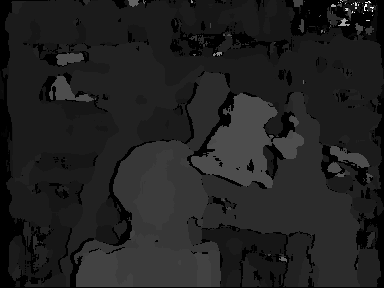

# stereo_matching_core


This is the VHDL implementation of a stereo-matching Hardware Accelerator for Stereo vision applications. This accelerator uses Census Transform with (50%) scarcity. Also, the accelerator employs the sum of hamming distances (SHD) to perform de stereo correspondence among left and right images. The accelerator implements the streaming processing computation approach. This HW implementation got inspiration from the work published by Wade S. Fife in [IEEE Xplore](https://ieeexplore.ieee.org/document/6213095)


The details of the architecture implementation can be found [here](https://github.com/divadnauj-GB/stereo_matching_core/blob/main/docs/Stereo_Match_Core.pdf). 

## System Requierements
- Ubuntu >=20.04 
- Python >=3.6
- Modelsim or Questasim


## How to use this repository

```
# Clone this repository
git clone https://github.com/divadnauj-GB/stereo_matching_core.git

# Run test the accelerator
cd stereo_matching_core
python3 run_stereo_simulation.py

```

After running the example, you will obtain a new image called Disparity_map.png, showing the results of the disparity map. The lighter colors represent objects closer to the camera, and darker colors belong to objects located further in the scene. 
  


